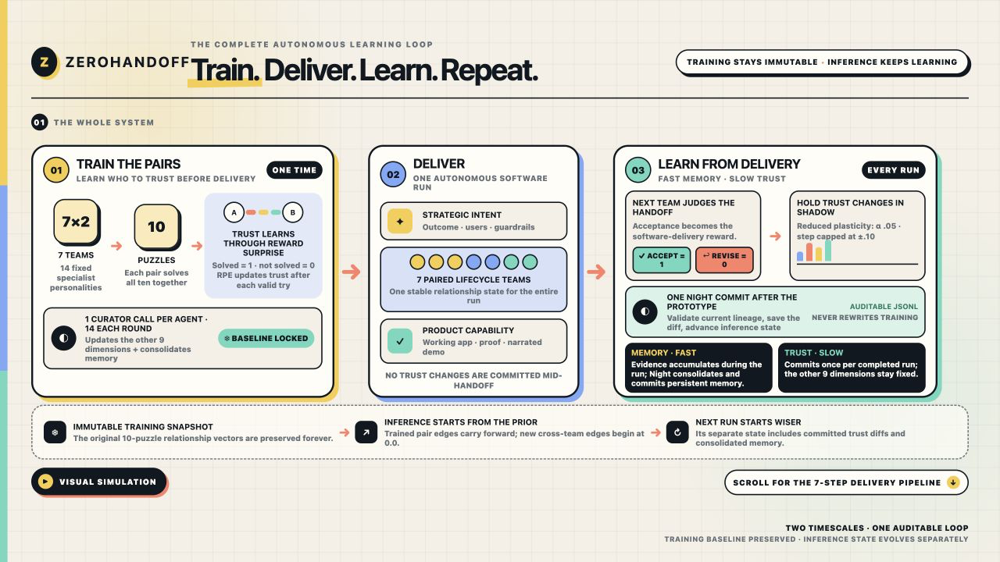
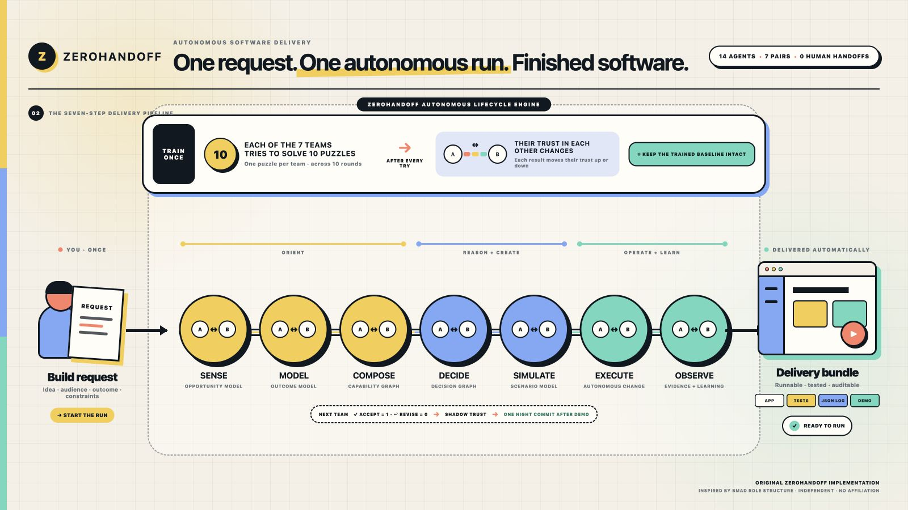

# ZeroHandoff — Autonomous Software Delivery

**One short build request in. A working, tested application and narrated demo out.**

[](overview.html#learning-system)

[](overview.html#delivery-pipeline)

ZeroHandoff is an autonomous software-delivery pipeline for the OpenAI Build Week
Developer Tools track. A person describes only what they want built, for whom,
the desired outcome, and any constraints. Codex turns that request into a
sequence of deliverables without human handoffs:

`Build Request → Opportunity Model → Outcome Model → Capability Graph → Decision Graph → Scenario Model → Autonomous Change → Evidence + Learning → Demo`

Seven two-agent lifecycle cells—SENSE, MODEL, COMPOSE, DECIDE, SIMULATE,
EXECUTE, and OBSERVE—own those seven stages, respectively. Each pair forms independent
judgments and passes one versioned artifact forward. These compact artifacts are
designed for agent-to-agent execution instead of long-form specifications,
planning ceremonies, or human handoff documents. Codex preserves project memory,
enforces quality gates, and routes failed contract checks through bounded repair
loops.

Every run produces an auditable delivery bundle:

- a runnable application with source and setup instructions;
- automated tests and quality-gate evidence;
- append-only JSON logs covering timestamps, runtime and model configuration,
  the immutable training baseline, run-start inference state, handoff rewards,
  shadow deltas, night commit, decisions, gates, repairs, artifacts,
  and the final outcome; and
- a generated narrated video demo.

## Setup and running

**Supported platforms.** The full ZeroHandoff engine supports macOS and Linux
with Python 3.11+, Node.js 22+, npm, Chrome/Chromium, FFmpeg, and Codex CLI
0.144.0+ authenticated with GPT-5.6 Sol access. The prebuilt EchoLedger sandbox
works on any desktop with a modern browser and a local static-file server.

### Fastest judge test — no install or rebuild

The repository includes the production build from the final autonomous run:

```bash
python3 -m http.server 8000 --directory submission/sandbox/echoledger/dist
```

Open `http://127.0.0.1:8000`. EchoLedger requires no account, backend, API key,
network service, or rebuild. Select **Complaint · 02:31**, redact evidence
`EV-015`, inspect the recurring signal, assign its action, export the local case
brief, and reset the fictional experience.

### Install the complete engine

```bash
python3 -m venv .venv
.venv/bin/pip install -e '.[dev]'
cd ui
npm ci
npm run build
cd ..
.venv/bin/python -m zerohandoff.cli --repo . doctor --live
```

### Run without model calls

This deterministic path exercises training, orchestration, gates, repair,
artifact handoffs, demo assembly, and bundling without spending model credits:

```bash
.venv/bin/python -m pytest -q
.venv/bin/python -m zerohandoff.cli --repo . puzzles validate
.venv/bin/python -m zerohandoff.cli --repo . train --adapter fixture --rounds 10
.venv/bin/python -m zerohandoff.cli --repo . run \
  --request tests/fixtures/build_request.json --adapter fixture
```

### Run the real Codex pipeline

The checked-in trained baseline means judges do not need to retrain. Open the
repository in Codex and enter:

```text
$run-pipeline
Build a local React application for [audience] that [desired outcome].
Constraints: [non-negotiable boundaries].
```

The skill collects one Build Request, validates the frozen baseline and current
inference lineage, then runs all seven stages, demo generation, and bundling with
GPT-5.6 Sol. Use `$pipeline-status` to inspect progress. To observe delivery in
the local Control Room, run:

```bash
.venv/bin/python -m zerohandoff.cli --repo . serve --port 8765
```

Then open `http://127.0.0.1:8765`.

### Sample data, outputs, and verification

- `tests/fixtures/build_request.json` is the agent-free sample request.
- `data/puzzles.jsonl` and `data/puzzle_stats.json` are the deterministic
  ten-puzzle training corpus and validation summary.
- `.zerohandoff/frozen/latest.json` is the checked-in immutable relationship
  baseline; real delivery starts from it rather than retraining.
- `submission/sandbox/echoledger/src/domain.ts` and
  `submission/sandbox/echoledger/public/audio/echoledger-el1042.wav` contain
  EchoLedger's entirely fictional local transcript/domain fixtures and synthetic
  recording. No real customer information is included.
- Each run is written to `.zerohandoff/runs/<run_id>/`, including versioned
  artifacts, `logs/*.jsonl`, the runnable app, narrated demo, checksums, and
  `delivery_bundle.nosync/`. Versioned continual-learning commits are under
  `.zerohandoff/learning/commits/`.

Verify the tracked judge package, training/run completion, trust invariants,
checksums, sandbox, and media streams with:

```bash
python3 scripts/submission_package.py verify
```

More internal commands and recovery behavior are in the [judge guide](JUDGE_GUIDE.md)
and [runbook](RUNBOOK.md).

Trust training supports the pipeline; it is not the product itself. Before
delivery, a separate ten-round, solver-validated puzzle pilot trains asymmetric
directed trust through reward prediction error and one single-prompt Night
Curator call per agent after each round. The resulting ten-dimensional vectors
form an immutable trained baseline for software-delivery inference: trust alone selects authority, while
a deterministic policy compiler turns up to three strong non-trust dimensions
into qualitative collaboration guidance without exposing raw scores. See the
[visual explainer](context/trust_moa.html) or the
[source specification](context/trust_moa.md) for the full design.

Inference copies that baseline into a separate evolving state. Trained pair
edges begin at their learned values; new cross-team edges begin at `0.0`.
Each next team gives a binary handoff reward—accept `1`, request revision `0`—but
trust stays stable during the run. One extra-high-reasoning Night Curator then
commits reduced-plasticity trust (`α=0.05`, step cap `±0.1`) and consolidated
memory once the prototype completes. The nine non-trust dimensions and the
original training JSON remain unchanged forever.

Codex was both the build environment and the hackathon reference runtime. It
accelerated the typed contracts, orchestration engine, agent configurations,
gates, repair/resume logic, browser proof, demos, and regression suite; GPT-5.6
Sol powers the fourteen specialists and Curators. The human chose the learning
rules, immutable-training/evolving-inference boundary, seven agent-native
artifacts, reduced-plasticity continual learning, zero post-authorization human
handoffs, and Codex-only hackathon scope. The deeper build story and ready-to-use
submission copy are in [`submission/`](submission/README.md).

Use `$run-pipeline`, `$pipeline-status`, and `$train-trust` from Codex chat.
Internal commands and the Control Room are documented in the [runbook](RUNBOOK.md).

ZeroHandoff is an independent original implementation conceptually inspired by the
[BMad Method](https://github.com/bmad-code-org/BMAD-METHOD). It does not copy or
redistribute BMad source, prompts, agent definitions, names, or branded assets,
and is not affiliated with or endorsed by BMad Code, LLC.

**Explore:** [visual pipeline](overview.html) · [system design](SYSTEM_DESIGN.md) ·
[execution plan](EXECUTION_PLAN.md) · [trust architecture](context/trust_moa.html) ·
[judge guide](JUDGE_GUIDE.md) · [submission package](submission/README.md) ·
[project idea](context/idea.md) · [tracked constraints](HACKATHON_CONSTRAINTS.md) ·
[MIT license](LICENSE)
