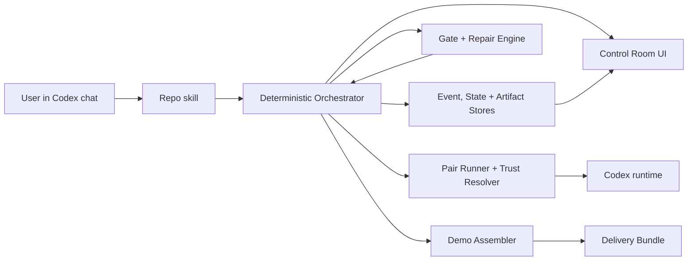

# ZeroHandoff System Design

Status: approved design for implementation

Decision date: 2026-07-14

Primary runtime: Codex with GPT-5.6

Primary experience: chat-native control with a UI-first delivery view

## 1. Product contract

ZeroHandoff accepts one Build Request containing an idea, audience, desired
outcome, and constraints. After the user starts the run, the system completes
the delivery pipeline without asking for product, design, architecture, or
implementation decisions.

For the hackathon, generated products are intentionally constrained to small,
local React + TypeScript + Vite web applications that require no external
services. This gives the full autonomous pipeline a credible, repeatable target
without pretending to support every software category in the first release.

The ordered delivery stages are:

`Build Request → Opportunity Model → Outcome Model → Capability Graph → Decision Graph → Scenario Model → Autonomous Change → Evidence + Learning → Narrated Demo`

Seven original two-agent delivery cells own those stages:

| Cell | Delivery responsibility | Primary artifact |
|---|---|---|
| SENSE | Opportunity discovery | Opportunity Model |
| MODEL | Outcome definition | Outcome Model |
| COMPOSE | Capability composition | Capability Graph |
| DECIDE | Technical and product decisions | Decision Graph and standalone HTML diagram |
| SIMULATE | Scenario and dependency planning | Scenario Model |
| EXECUTE | Autonomous software change | Autonomous Change and command evidence |
| OBSERVE | Evidence-based learning | Evidence + Learning and demo plan |

The final output is a Delivery Bundle containing the runnable application,
setup instructions, test and gate evidence, artifact history, append-only JSON
logs, immutable training snapshot, inference relationship lineage, and a narrated video of the finished
product.

## 2. Experience decision

The product is **hybrid and chat-native**:

- The user opens the repository in Codex and starts workflows conversationally.
- Training has no dedicated UI and no user-facing CLI. A repo skill starts or
  resumes the ten-puzzle training run and reports progress back in Codex chat.
- Delivery is UI-first. A local browser Control Room makes the autonomous run
  legible: intake, live stages, pair activity, trust-selected leads, artifacts,
  repairs, evidence, application preview, and final video.
- The deterministic engine and local API remain below both experiences. Skills
  may invoke internal scripts or non-interactive Codex execution, but the human
  never needs to operate a terminal.
- After a delivery run starts, the Control Room is observational. It exposes an
  emergency stop, but no approval or product-decision controls.

Primary chat workflows:

```text
$train-trust       # start or resume all seven pairs across ten puzzles
$run-pipeline      # collect one Build Request and run the delivery pipeline
$pipeline-status   # report current state, evidence, or terminal outcome
```

Codex loads durable project rules from `AGENTS.md`, the 14 project-scoped agent
personalities from `.codex/agents/*.toml`, runtime settings from
`.codex/config.toml`, and the chat workflows from `.agents/skills/`.

## 3. Architectural principles

1. **The deterministic engine owns control.** Models create and critique
   content, but code owns stage order, budgets, state transitions, validation,
   retries, repair routing, and terminal status.
2. **Every model boundary is typed.** Artifact-producing calls use JSON Schema;
   EXECUTE calls also return a typed change and verification report.
3. **Artifacts are immutable and versioned.** A repair creates a new version;
   it never overwrites the evidence that caused the repair.
4. **JSONL is the audit source of truth.** Mutable state and the UI database are
   rebuildable projections of append-only events.
5. **Training is immutable; inference learns on a separate timescale.** The
   published training vectors are permanent priors. Delivery uses a run-start
   copy, accumulates shadow trust deltas, and commits only after a completed prototype.
6. **Codex is the only hackathon host.** GitHub Copilot and Claude Code
   portability remain future work and add no implementation burden to the
   hackathon path.
7. **Autonomy is bounded.** Generated code runs in an isolated workspace with
   explicit filesystem, command, timeout, network, and repair limits.
8. **Fail closed.** Invalid output, unavailable authority, exhausted repair
   budgets, or unsafe Outcome Model items stop the run and produce a complete failure
   record instead of inventing success.

## 4. System architecture



### Chosen implementation stack

| Layer | Choice | Reason |
|---|---|---|
| Engine | Python 3.12 | Strong process, filesystem, schema, and test tooling |
| Domain contracts | Pydantic v2 + JSON Schema | One typed contract for code and agent output |
| Chat workflows | Codex repo skills | BMAD-like conversational entry points without terminal interaction |
| Agent roles | `.codex/agents/*.toml` | Project-scoped personalities and execution settings for all 14 agents |
| Internal runner | Python package entry points | Deterministic execution beneath chat and tests; not a user-facing CLI |
| Local API | FastAPI + Server-Sent Events | Simple local control and live event streaming |
| UI | React + TypeScript + Vite | Polished pipeline visualization without coupling to the engine |
| Audit source | Append-only JSONL | Portable, inspectable, hackathon-friendly evidence |
| Read model | In-memory/file projections | Keep JSONL authoritative and avoid unnecessary hackathon infrastructure |
| Browser capture | Playwright | Deterministic application walkthroughs and screenshots |
| Video assembly | ffmpeg/ffprobe | Reproducible media generation and validation |

## 5. Runtime boundaries

### 5.1 Orchestrator

The orchestrator is a resumable state machine. The happy path is:

```text
CREATED
→ INTAKE_VALIDATED
→ SEEK_RUNNING → SEEK_GATED
→ SHAPE_RUNNING → SHAPE_GATED
→ FRAME_RUNNING → FRAME_GATED
→ GROUND_RUNNING → GROUND_GATED
→ PACE_RUNNING → PACE_GATED
→ BUILD_RUNNING → BUILD_GATED
→ PROVE_RUNNING → PROVE_GATED
→ DEMO_RUNNING → DEMO_GATED
→ COMPLETED
```

Any stage may enter `REPAIRING`. Terminal alternatives are `FAILED`,
`CANCELLED`, and `INFRASTRUCTURE_FAILED`. A state transition is committed only
after its artifacts and event records are durable.

Each operation has an idempotency key:

`<run_id>:<stage>:<artifact_version>:<attempt>:<actor>:<operation>`

On resume, the orchestrator replays events, verifies artifact digests, discards
uncommitted temporary outputs, and continues from the last committed boundary.

### 5.2 Host adapter contract

The engine depends on a `HostAdapter`, not a vendor command:

```text
probe() -> HostCapabilities
prepare_run(RunContext) -> PreparedHost
invoke(AgentInvocation) -> AgentResult
cancel(invocation_id) -> CancellationResult
collect_trace(invocation_id) -> RawTraceReference
```

`AgentInvocation` contains:

- run, stage, pair, agent, role, and attempt IDs;
- objective and execution mode (`artifact`, `workspace`, `review`);
- immutable input-artifact references and digests;
- the frozen relationship-vector digest and derived trust stance;
- workspace root and permission profile;
- prompt and output-schema references;
- model, reasoning effort, timeout, and retry budget; and
- an optional host resume token.

`AgentResult` contains status, typed final output, produced file references,
normalized host events, raw trace reference, duration, usage when available,
resume token, and structured error information.

Required host capabilities are discovered, never assumed. Artifact calls need
prompt execution and a recoverable final response. EXECUTE additionally requires
workspace writes and shell execution. Streaming, native structured output,
resume, browser tools, and native subagents are optional capabilities that an
adapter may expose.

### 5.3 Codex reference adapter

`CodexExecAdapter` is the production adapter for the hackathon. It uses
non-interactive `codex exec` calls with:

- an explicit working directory;
- newline-delimited JSON events;
- an output schema for every typed final response;
- an explicit model and reasoning effort from run settings;
- `workspace-write` only for EXECUTE or approved repair work;
- read-only execution for proposal, review, and gate calls; and
- process-group timeouts and cancellation.

The conceptual invocation is:

```text
codex exec --json --output-schema <schema> --sandbox <mode> \
  -C <workspace> --model <configured_model> -
```

The prompt is passed on stdin. The adapter records the raw JSONL stream and
normalizes it into ZeroHandoff events. Non-interactive runs use a non-prompting
approval policy; a denied capability becomes a logged blocker. The system never
uses an unsafe sandbox-bypass flag as its normal operating mode.

Project `.codex/config.toml` stores trusted-repository defaults only. User auth,
provider credentials, and machine policy stay outside the repository. `doctor`
verifies the CLI binary, version, authentication readiness, model access,
sandbox behavior, required executables, and a schema-constrained test call
before a live run.

### 5.4 Codex-native repository configuration

The hackathon package exposes the system through the same repository that holds
the engine:

```text
AGENTS.md                         durable repository constraints
.codex/config.toml               project-scoped Codex runtime settings
.codex/agents/*.toml             14 custom agent identities and personalities
.agents/skills/train-trust/      chat workflow for training and freezing trust
.agents/skills/run-pipeline/     chat workflow for one autonomous delivery run
.agents/skills/pipeline-status/  chat workflow for progress and evidence
```

Each custom-agent TOML file declares its unique `name`, a narrow
`description`, and `developer_instructions`. Role files may set reasoning and
sandbox behavior, but they do not store user credentials. Repo skills define
the human-facing workflow and delegate deterministic work to the engine.

This split is intentional: `AGENTS.md` defines rules that apply to every task;
custom agents define who performs specialized work; skills define what happens
when the user invokes a reusable chat workflow. GitHub Copilot and Claude Code
configuration are deferred until after the hackathon.

A deterministic `FixtureAdapter` implements the same interface for smoke tests
without model or network calls.

### 5.5 Training runtime

`$train-trust` is a chat-native entry point into a deterministic, resumable
training state machine. Training itself has no browser UI.

1. In each of ten rounds, all seven fixed pairs attempt that round's puzzle,
   producing 70 team episodes.
2. Each training agent produces an initial and a revised task-solving message
   per episode, for 280 day-agent invocations before retries.
3. After all seven episodes in a round finish, the engine commits the mechanical
   RPE trust update per directed edge and updates shared difficulty expectations.
   It then invokes one single-prompt Night Curator for each of the 14 agents.
   These 140 curator invocations update memory and propose changes only to the
   nine non-trust relationship dimensions; curators never judge trust. Later
   calls consume those dimensions through a deterministic, versioned policy
   compiler.
4. Every attempt, result, reward, curator input/output, prior vector, updated
   vector, memory change, retry, and failure is written to JSON/JSONL evidence.
5. When all ten rounds pass validation, the system freezes the 14 final vectors,
   produces a manifest and digest, and removes all delivery-time mutation paths.

The frozen snapshot, digest, and representative training evidence ship with the
repository. Judges start a fresh delivery run from chat using those vectors;
they are not expected to rerun training.

## 6. Paired-agent protocol

Every delivery cell uses two agents with isolated first judgments.

### Standard artifact stages

1. Agent A and Agent B receive identical verified inputs, separately and in
   parallel. Neither sees the other proposal.
2. Both return schema-valid independent proposals.
3. The Trust Resolver selects the integration lead from the run-start directed
   trust values.
4. The lead receives both proposals and produces one integrated candidate,
   explicitly recording accepted and rejected ideas with reasons.
5. The peer reviews the integrated candidate and returns typed findings.
6. The deterministic gate combines schema checks, traceability checks, and peer
   findings to return `PASS`, `REPAIR`, `BLOCKED`, or `INFRA_ERROR`.

### EXECUTE stage

1. Both EXECUTE agents independently produce change steps from the Scenario Model.
2. The Trust Resolver selects the implementer; the other agent becomes reviewer.
3. The implementer edits only the isolated generated-application workspace and
   runs the declared install, lint, typecheck, test, build, and launch commands.
4. The reviewer inspects the diff and command evidence read-only.
5. The gate emits defects; the implementer performs bounded targeted repairs.

### OBSERVE stage

Both agents independently trace the Autonomous Change against the Outcome Model.
The trusted lead synthesizes Evidence + Learning and the demo plan; the peer audits
coverage and evidence before the final gate.

### Trust consumption

- Each agent sees only a qualitative stance toward its teammate derived from
  its outbound trust value.
- The agent with higher **inbound** trust becomes lead.
- If inbound trust ties, the agent with higher personality **Dominance** becomes
  lead. If Dominance also ties, the agent that **spoke last** becomes lead.
- Stable hashes, alphabetical order, and agent IDs are never trust tie-breakers.
- The lead, stance, values, vector digest, and selection reason are logged.
- Trust is the sole authority signal. The nine non-trust dimensions are soft
  behavior signals: a deterministic, versioned compiler selects at most the
  three strongest dimensions whose absolute value is at least `0.2` and renders
  qualitative collaboration guidance. Agents never receive the raw values.
- Negative values compile to bounded compensating behavior, never instructions
  to ignore facts, bypass gates, or become hostile. Canonical inputs, grading,
  rewards, permissions, and gate outcomes remain unaffected.
- Every compiled policy records its compiler version, selected dimensions,
  source-vector digest, and rendered guidance in
  `logs/relationship_policies.jsonl`.
- The published training JSON remains immutable forever. Inference creates a
  separate state: trained within-team edges retain their learned priors and all
  untrained cross-team edges begin at `0.0`.
- Prompt stance, authority, and the nine qualitative behavior signals use one
  hashed run-start snapshot. Shadow updates never change behavior mid-run.
- Every downstream pair assesses the immediately upstream artifact. Acceptance
  yields reward `1`; any requested revision yields reward `0` and one bounded
  repair is routed back to the producer.
- Trust-only shadow updates use RPE with `α=0.05`, a `±0.1` step cap, and the
  existing `[-1,+1]` range. The other nine dimensions remain frozen.
- After the demo passes, one `xhigh` Inference Night Curator audits the evidence,
  consolidates fast memory, and commits slow trust once. The next prototype
  starts from that new inference state; the training source never changes.
- Start state, end state, deltas from both the run start and training baseline,
  handoff rewards, memories, curator output, timestamps, and digests are JSON logged.

## 7. Artifact and handoff contract

Each committed artifact has a machine-readable envelope:

```json
{
  "schema_version": "1.1",
  "artifact_id": "build_contract",
  "artifact_type": "build_contract",
  "version": 1,
  "run_id": "run_...",
  "stage": "MODEL",
  "producer_pair": "MODEL",
  "lead": "...",
  "peer": "...",
  "input_digests": {},
  "content_files": [],
  "content_digest": "sha256:...",
  "contract_item_ids": [],
  "gate_status": "PASS",
  "created_at": "RFC3339"
}
```

Repairs increment `version`. Downstream stages receive only the latest verified
version, its envelope, and the curated project memory—not raw chat history.

Required handoffs:

| Stage | Required committed outputs |
|---|---|
| Intake | `build_request.json`, assumptions, input digest |
| SENSE | `opportunity_model.md`, `opportunity_model.json` |
| MODEL | `outcome_model.md`, `outcome_model.json` with testable outcome items |
| COMPOSE | `capability_graph.md`, `capability_graph.json`, and standalone `capability_graph.html` with capabilities, views, journey, and states |
| DECIDE | `decision_graph.md`, `decision_graph.json`, and a simple standalone `decision_graph.html` |
| SIMULATE | `scenario_model.md`, `scenario_model.json` with dependency-ordered work units |
| EXECUTE | `autonomous_change.md`, `autonomous_change.json`, generated app workspace, command and test evidence |
| OBSERVE | `evidence_and_learning.md`, `evidence_and_learning.json`, defects, `demo_plan.json`, narration script |
| Demo | capture manifest, audio, video, media validation report |
| Bundle | delivery manifest, checksums, setup instructions, logs, artifacts, app, video |

Outcome item IDs originate in the Outcome Model and propagate through capabilities,
system connections, work units, tests, proof entries, and demo steps.

`project_memory.json` stores only validated constraints, assumptions, decisions,
risks, interfaces, and terminology. Each stage proposes a typed memory patch;
the orchestrator validates and commits it after the stage passes.

## 8. Quality gates

Every gate runs deterministic checks first and peer-model checks second. A model
may report findings; only the deterministic gate engine changes stage status.

| Gate | Required evidence |
|---|---|
| Intake | Required fields present; no embedded secrets; safe autonomous scope |
| Opportunity Model | Intent, audience, desired outcome, boundaries, assumptions, success signals |
| Outcome Model | Unique testable outcome item IDs, priorities, acceptance checks, quality bars, exclusions, source links |
| Capability Graph | Capability, view, and journey coverage; responsive states; accessibility; empty/loading/error states; outcome links |
| Decision Graph | Minimal decisions, nodes and connections, data, security, verified commands, outcome coverage, standalone HTML diagram |
| Scenario Model | Every outcome item mapped to an executable work unit with done-when checks and an acyclic order |
| Autonomous Change | Declared commands execute; build and tests pass; app launches; no secret or license violations; change manifest complete |
| Evidence + Learning | Every must-have outcome item has reproducible evidence; no critical defects; observations complete |
| Demo | Captures the verified product; narration exists; media decodes; duration is below 180 seconds |
| Bundle | Manifest complete; checksums valid; setup tested; logs and licensing present |

Critical or high findings require repair. Medium findings require repair when
they affect a must-have contract item, safety, reproducibility, or demo success.
Low findings are logged and may pass.

## 9. Repair loops

Default budgets are configuration, not hidden constants:

```text
artifact_stage_repairs = 2
build_repairs = 3
prove_repairs = 2
demo_repairs = 2
cross_stage_repairs = 1
backend_retries_per_call = 1
```

A repair packet contains failed rule IDs, severity, evidence, exact artifact or
file references, the expected condition, prior attempts, remaining budget, and
the responsible stage. Repairs are targeted and produce a new artifact version.

OBSERVE classifies failures as:

- `implementation_defect` → EXECUTE repairs, the EXECUTE gate reruns, then OBSERVE reruns;
- `verification_defect` → OBSERVE repairs its tests or evidence;
- `specification_gap` → earliest responsible design stage repairs and all
  descendant artifacts are invalidated and regenerated once; or
- `unsafe_or_impossible` → terminal failure.

Exhausted budgets end the run as `FAILED` with the best partial bundle and full
evidence. The system does not ask the user to decide how to continue.

## 10. State, events, and JSON logging

Each run lives under `.zerohandoff/runs/<run_id>/`:

```text
manifest.json                 # terminal summary and effective settings
state.json                    # atomic, rebuildable checkpoint
events.jsonl                  # authoritative ordered event stream
logs/agent_calls.jsonl
logs/artifacts.jsonl
logs/gates.jsonl
logs/repairs.jsonl
logs/commands.jsonl
logs/demo.jsonl
raw/<adapter>/<invocation>.jsonl
artifacts/<stage>/<artifact>/<version>/
workspace/app/
delivery_bundle/
```

Every event includes:

```text
schema_version, event_id, sequence, run_id, timestamp, event_type,
phase, stage, attempt, actor, adapter, model, reasoning_effort,
relationship_vector_digest, settings_digest, input_refs, output_refs,
status, duration_ms, usage, git_commit, error, redactions
```

The run manifest records start and end time, host and versions, model settings,
intake and configuration digests, frozen vector snapshot and digest, all stage
outcomes, repair counts, artifact checksums, final outcome, and failure reason.

JSONL appends are serialized by one writer and flushed before the next state
transition. UI projections are rebuilt from the event stream and checkpoints.
Secrets are referenced by environment-variable name, never persisted by value;
known secret patterns are redacted before prompts, events, and bundles are saved.

## 11. Control Room and local API

The Control Room applies only to the delivery pipeline and has four views:

1. **Setup:** Codex readiness and the Build Request captured by the chat skill.
2. **Live run:** seven-stage pipeline, paired-agent activity, trust lead,
   current gate, repair budget, elapsed time, and event stream.
3. **Evidence:** versioned artifacts, traceability, commands, tests, diffs,
   failures, and JSON logs.
4. **Delivery:** runnable app instructions, preview link, checksums, verification
   summary, bundle export, and video playback.

Minimum API:

```text
POST /api/runs
GET  /api/runs
GET  /api/runs/{run_id}
GET  /api/runs/{run_id}/events        # SSE
GET  /api/runs/{run_id}/artifacts
GET  /api/runs/{run_id}/bundle
POST /api/runs/{run_id}/resume
POST /api/runs/{run_id}/cancel        # emergency stop only
GET  /api/doctor
```

## 12. Demo-generation path

Demo generation begins only after OBSERVE passes.

1. OBSERVE emits a schema-valid `demo_plan.json` whose steps reference proven
   contract item IDs, exact routes or commands, expected visual evidence, and a
   narration segment.
2. The Demo Assembler starts the application from
   `project_commands.json` and waits for its declared health check.
3. Playwright executes the plan against the generated React/Vite web app and
   records the verified flows and screenshots.
4. A `NarrationProvider` turns the approved script into audio. The initial
   implementation supports a configured speech provider and a deterministic
   fixture/system-voice fallback for tests.
5. ffmpeg composes captures, captions, provenance cards, and audio into a
   target 150-second video.
6. ffprobe and content checks verify duration below 180 seconds, decodable
   video and audio streams, resolution, non-empty segments, and checksum.
7. Failed capture or media checks use the bounded demo repair loop.

The video shows the Build Request, visible autonomous progress, the actual
   finished application, verification evidence, and how Codex and GPT-5.6 were
used. It never substitutes mock screens for the delivered application.

## 13. Isolation and safety

- Each run gets an isolated application workspace. Agent writes outside that
  workspace are denied.
- Proposal, integration, and review calls are read-only wherever possible.
- EXECUTE commands come from the verified decision command manifest and are
  recorded with exit code, duration, and output digest.
- Network access defaults off. A run may enable a domain allowlist derived from
  explicit integrations and package registries.
- The pipeline does not deploy, purchase, message people, change production
  systems, or publish externally unless the Build Request explicitly authorizes
  that action and an adapter policy supports it. The hackathon path produces a
  local runnable bundle.
- Timeouts terminate the complete process group. Backend errors do not commit
  artifacts or consume content-repair budget.
- Generated licenses and dependencies are scanned before bundling.

## 14. Planned repository shape

```text
pyproject.toml
src/zerohandoff/
  entrypoints/
  api/
  domain/
  orchestrator/
  runtime/{base,codex_exec,fixture}.py
  pairs/
  artifacts/
  gates/
  repair/
  events/
  training/
  demo/
ui/
roles/
prompts/
schemas/
settings/
tests/{unit,contract,integration,fixtures}/
.codex/
  config.toml
  agents/<14 custom-agent files>.toml
.agents/skills/
  train-trust/SKILL.md
  run-pipeline/SKILL.md
  pipeline-status/SKILL.md
pipeline/intake_template.md
```

## 15. Design acceptance criteria

The implementation conforms to this design only when:

- Codex discovers all 14 project agents and the three repo skills;
- `$train-trust` starts or resumes training without requiring terminal use;
- the fixture delivery run started from chat appears correctly in the Control
  Room;
- replacing the fixture adapter with Codex does not change orchestrator,
  artifact, gate, repair, event, or demo contracts;
- every agent output and artifact is schema-validated and digest-addressed;
- a killed run resumes without duplicating committed stages;
- a gate failure demonstrates a bounded repair and immutable artifact history;
- all run facts, trust snapshots, calls, commands, gates, repairs, artifacts,
  and outcomes are present in JSON logs;
- delivery cannot mutate the immutable training relationship snapshot;
- inference prompts remain stable within a run, while a successful end-of-run
  night commit advances only the separate trust overlay and memory;
- the repository includes the frozen vector snapshot and its digest so judges
  can run delivery without repeating training;
- `$run-pipeline` accepts a Build Request and completes a fresh end-to-end Codex
  run using that frozen snapshot;
- the finished bundle launches from documented setup instructions; and
- the generated narrated demo passes the sub-three-minute media gate.

## 16. Codex documentation basis

The Codex integration uses three documented customization layers: project
instructions in `AGENTS.md`, project-scoped custom agents in
`.codex/agents/*.toml`, and repo-scoped skills in `.agents/skills/`. Internal
agent execution may use the documented non-interactive `codex exec` surface for
working directory, sandbox, JSONL events, output schemas, and model selection.
Machine-local authentication and provider policy remain user-managed.

- [Codex developer commands](https://learn.chatgpt.com/docs/developer-commands#codex-exec)
- [Codex configuration reference](https://learn.chatgpt.com/docs/config-file/config-reference#configtoml)
- [Codex custom agents](https://learn.chatgpt.com/docs/agent-configuration/subagents#custom-agents)
- [Codex skills](https://learn.chatgpt.com/docs/build-skills)
- [Codex project instructions](https://learn.chatgpt.com/docs/agent-configuration/agents-md)
